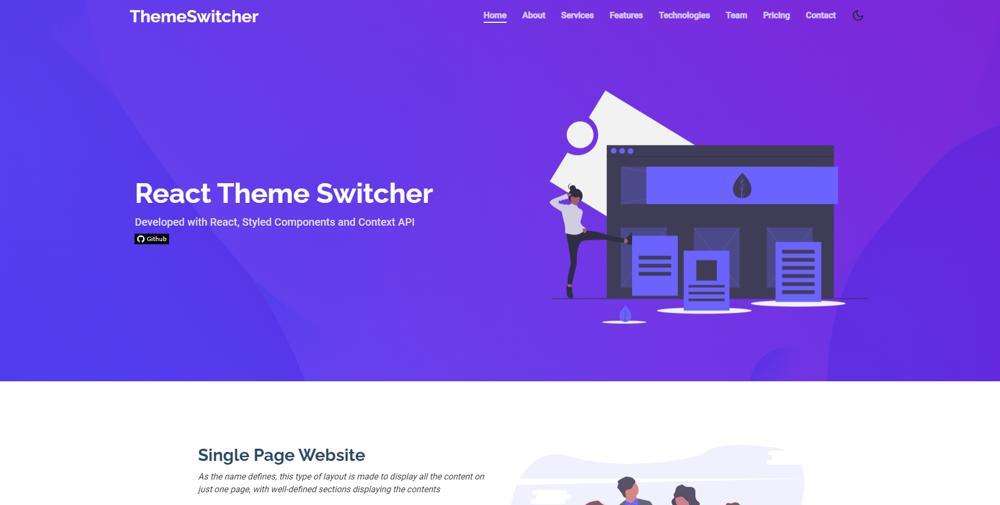
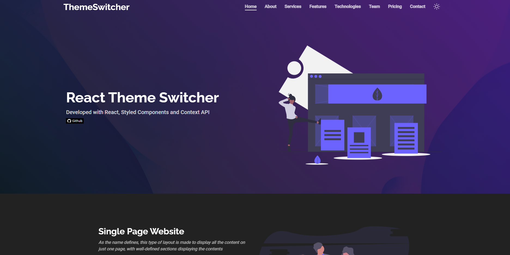

<h1>
  <a href="https://monteiro-alexandre.github.io/react-theme-switcher/">
    ReactThemeSwitcher
  </a>
</h1>


[](https://opensource.org/licenses/MIT)
[](http://makeapullrequest.com)

Landing page with Dark/Light theme switcher.

<br>

<p align="center">
  
</p>

<br>

<p align="center">
  
</p>

## 💻 Technologies

This project was developed with the following technologies:

- [Typescript](https://www.typescriptlang.org/)
- [React](https://reactjs.org)
- [Styled Components](https://styled-components.com/)
- [Context API](https://pt-br.reactjs.org/docs/context.html)
- [React Scroll](https://github.com/fisshy/react-scroll)
- [React Slick](https://react-slick.neostack.com/)
- [Eslint](https://eslint.org/)
- [Commitlint](https://commitlint.js.org/#/)

## 📝 Getting started

First you need to have `node` and `yarn` installed on your machine. Then, you can clone this repository.

```bash
git clone https://github.com/monteiro-alexandre/react-theme-switcher.git
```

Install dependencies:

```bash
yarn
```

After finishing the installation, run:

```bash
yarn start
```

To view the project you can open [localhost:3000](http://localhost:3000).

## 🤔 Contributing

Please read [CONTRIBUTING.md](.github/CONTRIBUTING.md) for details on the code of conduct and the process for submitting pull requests.

## License

This project is licensed under the MIT License - see the [LICENSE](LICENSE.md) file for details.
